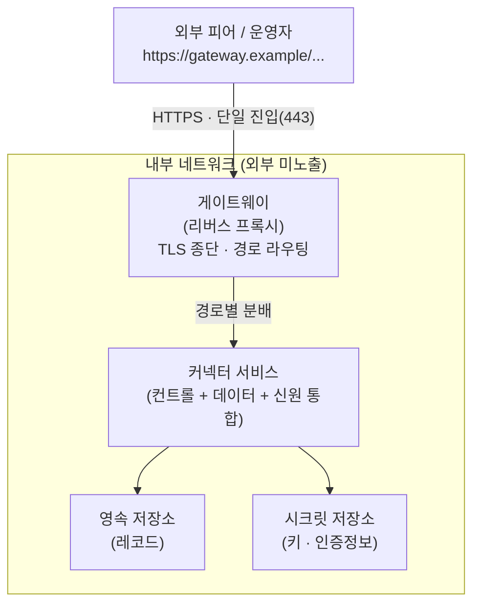

# 리버스 프록시 기반 서비스 구조 — 통신·보안 분석

> 실제로 다뤄본 배포 구조를 일반화한 모델 위에서 통신 경로와 보안을 분석한 노트.
> 서비스 이름은 일반화하고, 포트 번호는 구현마다 다르므로 **역할(role)** 로만 표기함.

---

## 0. 분석 대상 구조 (일반화)



구성 요소는 네 개로 단순화함.

- **게이트웨이(리버스 프록시)**: 외부와 만나는 유일한 지점. TLS 종단 + 경로 기반 라우팅 담당.
- **커넥터 서비스**: 실제 로직. 여러 종류의 엔드포인트를 한 프로세스/컨테이너에 통합.
- **영속 저장소(DB)**: 레코드 저장. 내부망 전용.
- **시크릿 저장소(Vault류)**: 키·인증정보 보관. 내부망 전용.

핵심 전제 두 가지:
1. 커넥터 서비스는 **외부 포트를 직접 열지 않음.** 외부 도달은 전부 게이트웨이 경유.
2. DB·시크릿 저장소는 **내부 네트워크에만 존재.** 외부에서 직접 가는 경로 자체가 없음.

---

## 1. 엔드포인트를 노출·인증 기준으로 분류

커넥터 서비스 안에는 성격이 다른 엔드포인트가 섞여 있음. 보안 분석의 출발점은 이를 **외부 도달 여부**와 **보호 수단** 기준으로 나누는 것임.

| 엔드포인트 그룹 | 외부 도달 | 보호 수단 | 민감도 | 비고 |
| --- | --- | --- | --- | --- |
| **관리 API** (운영자용) | 게이트웨이 경유 | API 키 인증 | **높음** | 자산·정책 등록/조작 가능 |
| **프로토콜 / 협상** (외부 피어용) | 게이트웨이 경유 | 신원검증(자격증명) | **높음** | 데이터 접근으로 가는 관문 |
| **신원 문서 / 공개 메타** | 게이트웨이 경유 | 없음 (공개 목적) | 낮음 | 원래 공개해야 작동함 |
| **데이터 전송 채널** | 게이트웨이 경유 | 토큰 / 합의 기반 | 높음 | 합의된 전송만 허용 |
| **내부 제어 / 헬스 / 버전** | **미노출** | 네트워크 격리 | — | 외부 도달 경로 자체가 없음 |

분류의 의미:
- 같은 서비스 안이라도 엔드포인트마다 **방어선이 다름.** "전부 동일하게 막혀 있다"가 아님.
- **공개 그룹**은 인증이 없는 게 정상임. 신원 문서는 다른 피어가 읽어야 신원 확인이 성립하므로 공개가 목적임. → 노출돼도 위험이 아님.
- **내부 제어 그룹**은 게이트웨이 라우팅에 등록되지 않아 외부에서 도달 불가. 호스트 내부로 들어와야만 접근 가능.

---

## 2. 통신 경로 — 방향별로 다름

### (1) 인바운드 (외부 → 우리)
```
외부 피어 → [HTTPS 443] → 게이트웨이 → [내부망] → 커넥터 서비스의 해당 엔드포인트
```
- 게이트웨이가 TLS를 종단하고, 경로(path)를 보고 내부 목적지로 평범한 HTTP 요청을 재전달함.
- 응답도 같은 경로로 되돌아 나감.
- **외부에서 들어오는 모든 것은 게이트웨이를 반드시 통과함.**

### (2) 내부 통신 (서비스 ↔ 저장소)
```
커넥터 서비스 ↔ DB
커넥터 서비스 ↔ 시크릿 저장소
```
- 내부 전용 네트워크에서만 일어남. 외부에 노출되지 않음.
- 게이트웨이를 거치지 않음(내부 컴포넌트 간 직접 통신).

### (3) 아웃바운드 (우리 → 외부 피어)
```
커넥터 서비스 → [인터넷] → 상대 게이트웨이 → 상대 서비스
```
- 우리가 먼저 외부 피어에게 요청하는 경우, **우리 게이트웨이를 거치지 않음.**
- 우리 게이트웨이는 "외부 → 우리" 인바운드만 받는 입구이고, 아웃바운드는 서비스가 직접 나감.
- 도착지에서는 **상대방의 게이트웨이**가 받음.

> 정리: "들어오는 것"은 우리 게이트웨이를 통과하지만, "우리가 먼저 거는 것"은 상대방 게이트웨이로 감.

---

## 3. 공격 표면 분석 — 이 구조 기준

### 외부 스캔 시 보이는 것
- 노출 포트는 게이트웨이의 **443 하나뿐.**
- 커넥터의 내부 포트들은 컨테이너 네트워크 안에만 존재 → 호스트 바깥으로 매핑되지 않음.
- 라우팅 규칙(어느 경로가 어느 내부 포트로 가는지)을 전부 알아도 **통신로 자체가 없으면 도달 불가.**
  - "포트 번호를 모른다"가 아니라 **"그 문이 바깥에 존재하지 않는다"** 가 방어의 본질.

### 내부에 도달하는 경로
| 경로 | 방법 | 차단/방어 지점 |
| --- | --- | --- |
| ① 게이트웨이(443) 정식 진입 | 프록시 취약점, API 키 유출, 신원검증 우회 | 프록시 버전 관리, 강한 키, 엄격한 신뢰 발급자 |
| ② 호스트 셸 장악 | SSH·타 서비스 취약점 → 셸 획득 | SSH 키 인증, 불필요 포트 차단, 패치 |
| ③ 옆걸음(lateral movement) | 컨테이너 1개 장악 → 같은 내부망의 DB·시크릿 저장소로 이동 | 컨테이너 권한 최소화, 저장소 접근 제한 |
| ④ 서비스 거부(DoS) | 443에 트래픽 폭주 / 인증 전 도달 가능한 엔드포인트 고갈 | 레이트 리밋, 리소스 여유, 프록시 보호 |

### 표면별 위험도 정리
- **가장 단단한 면**: 내부 제어 포트. 외부 도달 경로가 아예 없어 ②③ 없이는 못 닿음.
- **인증 벽이 막는 면**: 관리 API(키), 프로토콜/전송(신원·토큰). 443까지 와도 여기서 걸림.
- **인증 없는 면(의도된)**: 공개 신원 문서. 위험은 아니나, 여기로 들어온 요청량 자체는 무방비라 **DoS 표면**이 될 수 있음.
- **신원검증 이전 표면**: 협상 엔드포인트는 자격증명 검증 전에 일단 요청을 받아 처리 시작하므로, 인증 없이도 두드릴 수 있는 **리소스 고갈 표면**임.
- **최종 목표**: 시크릿 저장소. 키·인증정보가 모여 있어 ③ 옆걸음의 종착지가 됨.

---

## 4. 이 구조의 보안 설계 요점

**잘 분리된 부분**
- 외부 노출을 게이트웨이 443 하나로 좁혀 공격 표면 최소화.
- DB·시크릿을 내부 전용망에 격리 → 외부 직결 경로 제거.
- 엔드포인트를 민감도별로 다른 방어선(API 키 / 신원검증 / 공개)에 배치.

**구조만으로는 못 막는 부분 (별도 방어 필요)**
- 게이트웨이로 들어온 뒤의 **인증·인가 강도** (키 길이, 신뢰 발급자 범위).
- **호스트 자체 보안** — 셸이 뚫리면 경계 분리가 전부 무력화됨.
- **옆걸음 차단** — 내부망을 공유하는 이상, 한 컨테이너 장악이 저장소 접근으로 번질 수 있음.
- **인증 이전 표면의 DoS** — 신원검증 전에 도달 가능한 경로의 리소스 보호.

---

## 5. 한 줄 요약

- 외부 진입은 게이트웨이(443) **하나**, 나머지 내부 포트는 외부에 존재하지 않음 → 라우팅을 알아도 못 들어감.
- 같은 서비스라도 엔드포인트마다 방어선이 다름(키 / 신원검증 / 공개 / 미노출).
- 내부 통신·저장소는 내부망 격리, 외부 직결 경로 없음.
- 내부에 닿으려면 **443 정식 돌파(인증·인가 우회)** 또는 **호스트 셸 장악**, 진입 후엔 **옆걸음으로 시크릿 저장소**가 표적.
- 경계 분리는 1차 방어일 뿐, 인증 강도·호스트 보안·옆걸음 차단·DoS 보호는 **별도 계층**으로 챙겨야 함.

---

### 메모
- 핵심 추상화: **"포트 노출 ≠ 접근 가능", "접근 가능 ≠ 인증 통과".** 세 층(통신로 / 인증 / 인가)을 분리해서 봐야 함.
- 이런 류 시스템은 망 보안보다 **신원 중심 접근제어**가 실질 방어선이고, 통신로 분리는 그 위에 얹는 경계임.
